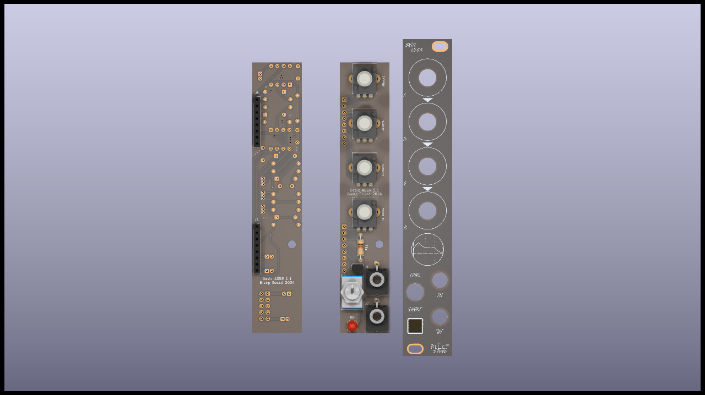

# Basic ADSR

Basic ADSR based on René Schmitz [Fastest envelope in the West](https://www.schmitzbits.de/adsr.html). 

Four pots, one input, one output (just what you need).

On switch to change the time constant of the ADSR. I chose some arbitrary values for the capacitors in my case, but if you want different values, you can adjust them to your needs. 

Just change the values of **C8** and **C9**, which can be either polarized electrolytic or unpolarized capacitors. Just make sure you get the orientation right on the polarized ones.

## Schematics

## BoM

[See bom](documentation/bom/Basic-ADSR_V1.0--iBoM.html)

## Build Informations

Regular build, I use ceramic capacitors but you can use film/polyester.

:warning: When building modules, always do it in this order (from smallest component to highest):
- diodes
- resistors
- DIP chips
- capacitors (film/ceramic)
- Transistors
- Electrolytic capacitors

To solder the headers, place them and place both PCBs in their final position before fully soldering the pin headers/sockets.

For the next parts, always place them without soldering them on: 
- jacks, pots and switches that go throught the front panel

Once placed, put the front panel in place, then fasten all components to it. Once this is done, you can solder all the remaining components.

## Images

